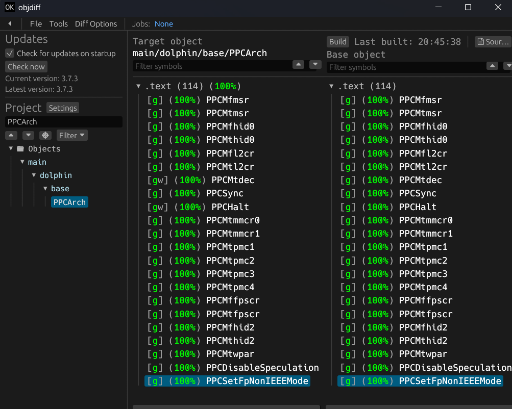

# Sonic Heroes

[![Build Status]][actions]

[Build Status]: https://github.com/Jovinull/sonicheroes/actions/workflows/build.yml/badge.svg
[actions]: https://github.com/Jovinull/sonicheroes/actions/workflows/build.yml

[![Code Progress]][progress] [![Data Progress]][progress]

[Code Progress]: https://decomp.dev/Jovinull/sonicheroes.svg?mode=shield&measure=code&label=Code
[Data Progress]: https://decomp.dev/Jovinull/sonicheroes.svg?mode=shield&measure=data&label=Data
[progress]: https://decomp.dev/Jovinull/sonicheroes

A work in progress decompilation of Sonic Heroes for the Nintendo GameCube.

This is a non-commercial study and preservation project. It is not affiliated
with SEGA.

This repository contains no game code, no game assets and no assembly. You need
your own legally obtained copy of the game to build it. The project does not
produce a playable game and is not a port.

Supported version:

* `G9SE8P`, GameCube, North America (NTSC-U), revision 0

Planned later: `G9SP8P` (PAL) and `G9SJ8P` (NTSC-J).

## Status

`main.dol` currently rebuilds byte for byte identical to the original disc.
That only means the toolchain works. Nothing is decompiled yet. The disc ships
no `.map` file, so symbols and translation unit boundaries have to be worked out
by hand.

18 REL modules ship alongside `main.dol`. 17 of them are configured. `stage00D`
is excluded for now, see the note at the end of `config/G9SE8P/config.yml`.

## AI assistance

I use LLMs to help write this decompilation. Nothing goes in unverified: every
function has to match the original byte for byte in objdiff, and CI checks the
SHA-1 of the built DOL on every push. A function either reproduces the original
binary exactly or it does not get marked as matching.

## Dependencies

You need Python and ninja on your `PATH`.

### Windows

Use native tooling. WSL and msys2 are not needed, and objdiff cannot watch files
for automatic rebuilds under WSL.

* [Python](https://www.python.org/downloads/)
* [ninja](https://github.com/ninja-build/ninja/releases), or `pip install ninja`

### macOS

```sh
brew install ninja
```

### Linux

Install ninja from your package manager.

On macOS and Linux, [wibo](https://github.com/decompals/wibo) is downloaded
automatically to run the original Windows compilers.

## Building

Clone the repository:

```sh
git clone https://github.com/Jovinull/sonicheroes.git
```

Turn on the repository hooks once, so a commit that stages game data or build
output is refused before it happens:

```sh
git config core.hooksPath .githooks
```

Put your copy of the game in `orig/G9SE8P/`. Either drop the disc image there
(ISO, RVZ, GCM, WBFS, CISO, GCZ, NFS or TGC), or extract the disc with Dolphin
into that folder. If you use a disc image, it can be deleted after the first
build.

Then:

```sh
python configure.py
ninja
```

The build currently stops at the checksum step, because the RELs do not match
yet. `main.dol` does.

## Diffing

After the first build there will be an `objdiff.json` in the project root.

Get [objdiff](https://github.com/encounter/objdiff), open project settings and
point `Project directory` at this repository. It picks up the config on its own.
Pick an object in the sidebar to start diffing. It rebuilds automatically when
you edit source, headers, `configure.py`, `splits.txt` or `symbols.txt`.



## Contributing

See [CONTRIBUTING.md](CONTRIBUTING.md).

## Legal

See [LEGAL.md](LEGAL.md).
