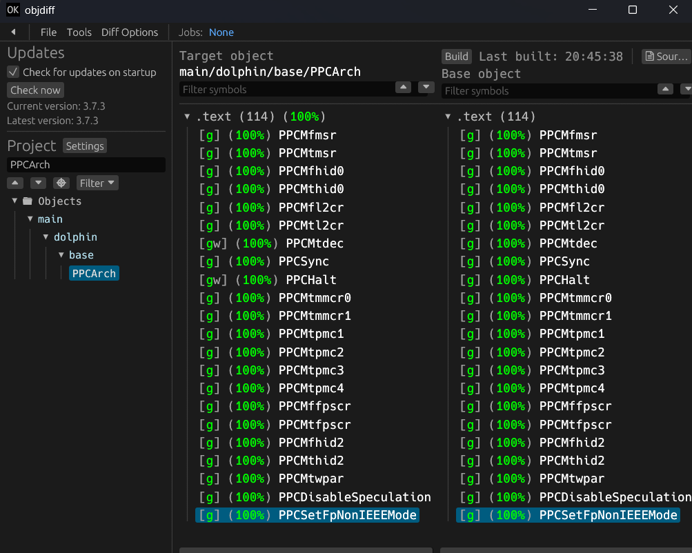

# Sonic Heroes

[![Build Status]][actions] [![Code Progress]][progress] [![Data Progress]][progress] [![SDK Progress]][progress] [![Game Progress]][progress] [![Discord]][chat]

[Build Status]: https://github.com/Jovinull/sonicheroes/actions/workflows/build.yml/badge.svg
[actions]: https://github.com/Jovinull/sonicheroes/actions/workflows/build.yml
[Code Progress]: https://decomp.dev/Jovinull/sonicheroes.svg?mode=shield&measure=code&label=Code
[Data Progress]: https://decomp.dev/Jovinull/sonicheroes.svg?mode=shield&measure=data&label=Data
[SDK Progress]: https://decomp.dev/Jovinull/sonicheroes.svg?mode=shield&measure=code&category=sdk&label=SDK
[Game Progress]: https://decomp.dev/Jovinull/sonicheroes.svg?mode=shield&measure=code&category=game&label=Game
[progress]: https://jovinull.github.io/sonicheroes/
[Discord]: https://img.shields.io/discord/1529475492200059032?label=chat&logo=discord&logoColor=white&color=7289da
[chat]: https://discord.gg/VGCHZMXUWN

A work in progress decompilation of Sonic Heroes for the Nintendo GameCube.

This is a non-commercial study and preservation project. It is not affiliated
with SEGA.

This repository contains no game code, no game assets and no extracted
assembly. Some functions are written as inline assembly in the source, which is
explained under Status. You need your own legally obtained copy of the game to
build it. The project does not produce a playable game and is not a port.

Supported version:

* `G9SE8P`, GameCube, North America (NTSC-U), revision 0

Planned later: `G9SP8P` (PAL) and `G9SJ8P` (NTSC-J).

## GameCube target and cross-platform evidence

This is a GameCube decompilation. The `G9SE8P` GameCube machine code, object
layout and artifact hashes are authoritative for every match.

Some corresponding PS2 builds preserve useful symbol metadata. Maintainers may
inspect a legally obtained PS2 copy locally to help classify a translation unit
as C or C++, recover a symbol name or signature, and understand class or source
structure. That evidence is only a cross-platform lead: it must be correlated
with the GameCube unit and verified by GameCube objdiff. It cannot establish a
GameCube byte match on its own.

The repository does not contain or distribute PS2 disc images, executables,
extracted code or complete symbol dumps, and contributors do not need a PS2 copy
to work here. Reviewed classifications and the minimum useful evidence are
recorded in the repository. See the
[source-language policy](docs/language-policy.md) for the workflow, the
[current migration audit](docs/language-audit.md) for reviewed decisions, and
[LEGAL.md](LEGAL.md) for the artifact rules.

## Status

The progress badges and generated objdiff report are authoritative; avoid
copying percentages into prose because they become stale.

`main.dol` and all 17 configured REL modules rebuild byte for byte. Their hashes
are stored in `config/G9SE8P/build.sha1`, and CI verifies all eighteen artifacts
on every change. `stage00D` is not configured; see the note at the end of
`config/G9SE8P/config.yml`.

Exact linked artifacts do not mean that every function has been reconstructed
as source. Unwritten regions can still be carried through the decompilation
build, so source progress must be read from objdiff rather than from the final
SHA-1 result alone.

The disc ships no `.map` file. Names and translation-unit boundaries are argued
from GameCube cross references, private data, alignment and correlated metadata.
PS2 symbols can supply cross-platform names and class evidence, but every
conclusion is checked against the GameCube object. See the
[source-language policy](docs/language-policy.md) and
[current audit](docs/language-audit.md).

Some SDK units legitimately require inline assembly for instructions with no C
form, such as special-purpose-register and cache operations. Generated assembly
and all other extracted binary material remain under ignored build/original
directories and are never committed.

Reproducing the RELs needed a fix to decomp-toolkit. These RELs reserve an empty
section slot before `.text` which mwld drops during the partial link, because
nothing lands in it; dtk wrote its section table straight from the object
indices, so every section came out one index low and the header fields shifted
with them. The project therefore pins a
[fork](https://github.com/Jovinull/decomp-toolkit) carrying that change, tagged
`v1.8.3-sh1`. It is reported upstream as
[encounter/decomp-toolkit#144](https://github.com/encounter/decomp-toolkit/issues/144);
point `tools/download_tool.py` back at upstream once it lands there.

## AI assistance

I use LLMs to help write this decompilation. Nothing goes in unverified: every
function has to match the original byte for byte in objdiff, and CI checks the
SHA-1 of the built DOL on every push. A function either reproduces the original
binary exactly or it does not get marked as matching.

## Dependencies

You need Python and ninja on your `PATH`.

### Windows

Use native tooling. WSL and msys2 are not needed, and objdiff cannot watch files
for automatic rebuilds under WSL.

* [Python](https://www.python.org/downloads/)
* [ninja](https://github.com/ninja-build/ninja/releases), or `pip install ninja`

### macOS

```sh
brew install ninja
```

### Linux

Install ninja from your package manager.

On macOS and Linux, [wibo](https://github.com/decompals/wibo) is downloaded
automatically to run the original Windows compilers.

## Building

Clone the repository:

```sh
git clone https://github.com/Jovinull/sonicheroes.git
```

Turn on the repository hooks once, so a commit that stages game data or build
output is refused before it happens:

```sh
git config core.hooksPath .githooks
```

Put your copy of the game in `orig/G9SE8P/`. Either drop the disc image there
(ISO, RVZ, GCM, WBFS, CISO, GCZ, NFS or TGC), or extract the disc with Dolphin
into that folder. If you use a disc image, it can be deleted after the first
build.

Then:

```sh
python configure.py
python tools/check_language_policy.py
ninja
```

The checksum step verifies `main.dol` and all 17 configured REL modules.

## Diffing

After the first build there will be an `objdiff.json` in the project root.

Get [objdiff](https://github.com/encounter/objdiff), open project settings and
point `Project directory` at this repository. It picks up the config on its own.
Pick an object in the sidebar to start diffing. It rebuilds automatically when
you edit source, headers, `configure.py`, `splits.txt` or `symbols.txt`.



## Contributing

See [CONTRIBUTING.md](CONTRIBUTING.md).

Game-owned code is C++ by default, while reviewed C boundaries and known C
libraries remain C. Legacy `.c` paths that already compile with `-lang=c++` are
migrated to `.cpp` in verified batches, not rewritten all at once. Each batch
records its language evidence and must preserve the GameCube object before it is
accepted. The exact policy and migration checklist are in
[docs/language-policy.md](docs/language-policy.md).

External resources that help with naming functions and structs (community
disassemblies, SDK headers, format documentation) are tracked in
[REFERENCES.md](REFERENCES.md).

## Legal

See [LEGAL.md](LEGAL.md).
